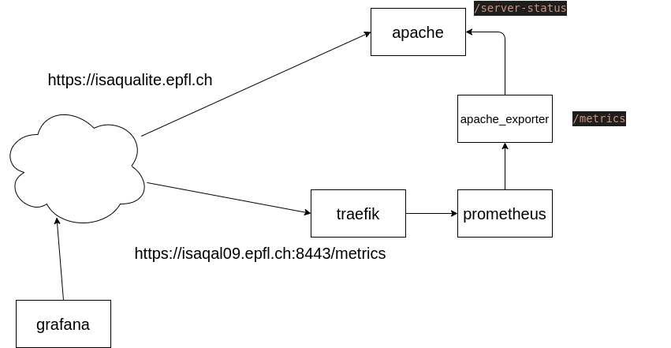
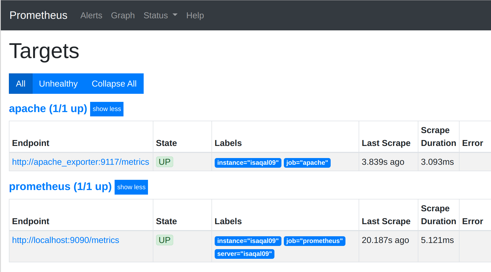
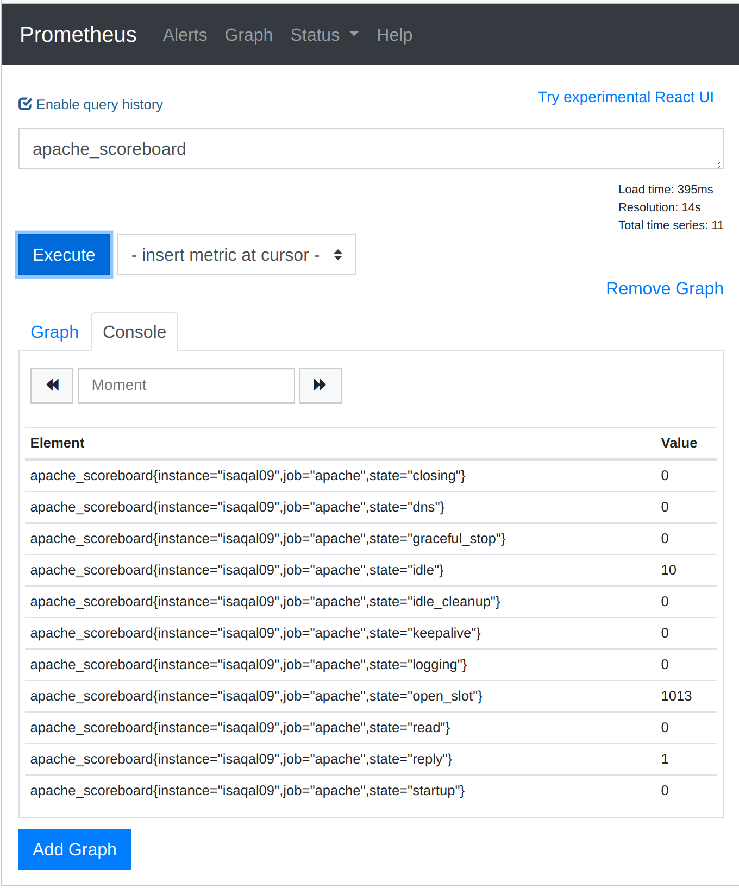

# ISA Monitoring

## But

Le but est de remonter des métriques du scoreboard d'Apache dans Prometheus et Grafana.

## Schéma



### Apache

Apache doit avoir le module status.

```
[root@isaqal09 ~]# apachectl -t -D DUMP_MODULES | grep status 
 status_module (shared)
Syntax OK
```

La configuration d'Apache est modifiée afin de pouvoir avoir:

```
[root@isaqal09 ~]# curl http://localhost/server-status?auto 
Total Accesses: 6111
Total kBytes: 28367
CPULoad: .0694061
Uptime: 20272
ReqPerSec: .30145
BytesPerSec: 1432.9
BytesPerReq: 4753.36
BusyWorkers: 1
IdleWorkers: 10
Scoreboard: _____W_____...................................................................................................................................................................................................................................................................................................................................................................................................................................................................................................................................................................................................................................................................................................................................................................................................................................................................................................................................................................
```

### Apache exporter

[Apache exporter](https://github.com/Lusitaniae/apache_exporter) a pour but de scraper les données d'Apache à l'adresse `localhost/server-status?auto` et de préparer les métriques au format souhaité par Prometheus.

'Apache exporter' tourne dans un conteneur docker.

On peut se convaincre que apache_exporter fonctionne convenablement. 
Pour cela, on se connecte au conteneur `apache_exporter` 

`docker exec -it apache_exporter sh`

Puis:

```
# wget localhost:9117/metrics
Connecting to localhost:9117 (127.0.0.1:9117)
saving to 'metrics'
metrics              100% |*****************************************************************************************************************************************|  7831  0:00:00 ETA
'metrics' saved
```

et enfin:

```
/ # cat metrics 
....
# TYPE apache_scoreboard gauge
apache_scoreboard{state="closing"} 0
apache_scoreboard{state="dns"} 0
apache_scoreboard{state="graceful_stop"} 0
apache_scoreboard{state="idle"} 10
apache_scoreboard{state="idle_cleanup"} 0
apache_scoreboard{state="keepalive"} 0
apache_scoreboard{state="logging"} 0
apache_scoreboard{state="open_slot"} 1013
apache_scoreboard{state="read"} 0
apache_scoreboard{state="reply"} 1
apache_scoreboard{state="startup"} 0
...
```

### Prometheus

On peut accéder à l'interface de Prometheus à l'adresse suivante `https://isaqal09.epfl.ch:8443/`

#### Targets

`https://isaqal09.epfl.ch:8443/targets`



#### Queries

`https://isaqal09.epfl.ch:8443/graph?g0.range_input=1h&g0.expr=apache_scoreboard&g0.tab=1`



Prometheus tourne dans un conteur docker.

### Traefik

On utilise traefik principalement pour mettre en place une "basic auth".

Le nom de l'utilisateur et le mot de passe sont stockés dans keybase.

TODO: Ajouter les bonnes personnes (qui?) dans la team epfl_isa via son email

### Grafana

On utilise le "Grafana as a service" de c2c à l'adresse https://grafana-exopge.epfl.ch.
Notre organisation a pour nom "EPFL IS-Academia".

Dans l'application groups.epfl.ch, le group [grafana-exopge-isacademia-org-editors](https://groups.epfl.ch/cgi-bin/groups/viewgroup?groupid=S27146) permet de définir les utilisateurs qui peuvent gérer des dashboards.

TODO: Ajouter les bonnes personnes (qui?) dans ce groupe

## Ansible

Nous utilisons [Ansible](https://www.ansible.com/) pour mettre en place les conteneurs Docker et l'ensemble de la configuration nécessaire (configuration apache, gestion IPTables, certificat SSL, etc).
Il s'agit donc d'une "configuration as code"

### Prérequis 

Pour pouvoir effectuer le déploiement, il faut: 

- Installer ansible (sur la machine de l'opérateur)
- Récupérer les sources de https://github.com/epfl-si/isa-monitoring (sur la machine de l'opérateur)
- Avoir un accès SSH aux serveurs cibles (Voir la section Tremplin ci-dessous)
- Appartenir à la team epfl_isa de keybase (pour la lecture des secrets)

#### Tremplin

- Créer un compte sur https://tremplin.epfl.ch/.
  Pour plus d'infos: https://tremplin.epfl.ch/ssh.html
- Ensuite dans le fichier `~/.ssh/config` ajouter cela:

```
Host isaqal09 isaqal10
     User <username>
     ProxyCommand /bin/nc -x 127.0.0.1:3333 %h %p

Host isaqal09-proxy
     Hostname isaqal09
     DynamicForward 3333
     User <username>
     ProxyJump <sciper>@tremplin.epfl.ch%    
```

Note: Il faut remplacer <username> et <sciper> par vos données

Il est maintenant possible de se connecter aux machines en faisant:

- `ssh isaqal09-proxy`
- `ssh isaqal10`

#### via Ansible

Pour que ansible puisse se connecter aux serveurs, il faut toujours avoir la commande suivante lancée dans un terminal

`ssh isaqal09-proxy`

### Déploiement

La commande ci-dessous vous permet de déployer l'ensemble de la configuration sur les serveurs 'qualité' c'est à dire les hosts `isaqal09` et `isaqal10`

```
./ansible/isasible
```

La commande ci-dessous vous permet de déployer l'ensemble de la configuration sur `isaqal09` uniquement
```
./ansible/isasible -l isaqal09
```

Pour déployer sur les serveurs de production, il faudra modifier le fichier:
`ansible/inventory/hosts-prod.yml` => Voir #TODO

```
./ansible/isasible --prod
```
### Les différentes étapes du déploiement

#### Étape 1: Installation des dépendances/paquets python

Dans cette étape, on installe pip et quelques dépendances python (urllib3, request, docker-py)

#### Étape 2: Installation de docker

Dans cette étape, on télécharge, on installe et on lance Docker

#### Étape 3: Modification des règles iptables

Dans cette étape, on configure les règles iptables pour la gestion des ports suivants:
- en production, seul le port 8443 sera ouvert
- en isaqualité, les ports 8080 et 8443 sont ouverts

#### Étape 4: Modification de la configuration Apache

Dans cette étape, on modifie la configuration Apache pour avoir le bloc ci-dessous présent:

```
# BEGIN apache server status
<Location /server-status>
  SetHandler server-status

  Order Deny,Allow
  Deny from all
  # Allow from both Docker containers and localhost:
  Allow from 127.0.0.1 172.16.0.0/15
</Location>
# END apache server status
```
dans le fichier /etc/httpd/conf.d/EPFL_isa.conf

#### Étape 5: Installation de Apache Exporter

Dans cette étape, on lance le conteneur docker Apache Exporter

#### Étape 6: Installation de Prometheus

Dans cette étape, on lance le conteneur docker Prometheus

Sa configuration est présente dans le répertoire /srv/isa/prometheus

#### Étape 7: Installation de Traefik

Dans cette étape, on lance le conteneur docker Traefik

Sa configuration est présente dans le répertoire /srv/isa/traefik.

Dans le répertoire /srv/isa/traefik/ssl il y a la clé privé et le certificat SSL auto signé